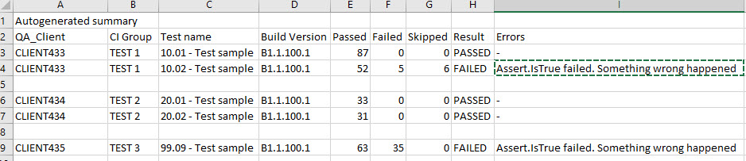

## ReportGenerator
Console application, scanning a folder, parsing filenames and returns a csv-file with files list. 

### Example: 
We have the folder C:\Test Results\CI, which contains subfolders like  
10_22_2018 
10_23_2018  
10_24_2018, etc.  
 
Each of them contains some subfolders like  
CLIENT433_TEST 1  
CLIENT434_TEST 2 
CLIENT434_TEST 3, etc. 

In it's turn, each of the subfolders contains diffrent trx-files like this: 

10.01-Test sample_B1.1.100.1_87_0_0.trx 
10.02-Test sample_B1.1.100.1_52_5_6.trx 
20.01-Test sample_B1.1.100.1_33_0_0.trx 
20.02-Test sample_B1.1.100.1_31_0_0.trx 
99.09-Test sample_B1.1.100.1_63_35_0.trx 

The program parses the full path to each file and writes each file in summary. 
Full path example - C:\Test Results\CI\10_22_2018\CLIENT435_TEST 3\99.09-Test sample_B1.1.100.1_63_35_0.trx  
In addition, if the trx-file contains error records, the first five of them are being recorded in summary report. 

#### Example of final csv-report (opens in Excel): 

I doubt that this program can be useful for anybody else, but it served me quite well. 